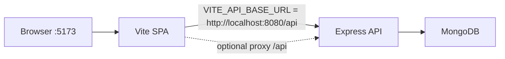

# ShortIt Technical Audit and Repair Plan

Last updated: 8 October 2026

This document is the working audit for ShortIt. Phases 1–7 are implemented. Live GitHub/Render/Atlas publishing is still a manual step you authorize.

## Progress

| Phase | Status |
| --- | --- |
| 1. Environment, configuration, and startup | **Complete** |
| 2. Authentication and authorization | **Complete** |
| 3. Backend API completion and database integration | **Complete** |
| 4. Frontend functionality and API integration | **Complete** |
| 5. Error handling, validation, and security improvements | **Complete** |
| 6. Testing and regression verification | **Complete** (Vitest + Playwright E2E against isolated Mongo) |
| 7. Portfolio readiness, documentation, and final polish | **Complete** (Render/Atlas $0 packaging; no live deploy) |

---

## 1. Project architecture overview

ShortIt is a two-app URL shortener (no root `package.json`).

- **Frontend:** React 19, Vite 8, TypeScript, React Router 7, Axios, Tailwind 4, shadcn/Radix. Auth is React Context plus `localStorage` key `shortit_token`.
- **Backend:** Express 5, Mongoose 8, bcrypt, jsonwebtoken. JWT Bearer auth. Port from `PORT` (default 8080).
- **Database:** MongoDB. `User` (unique email, hashed password) and `Link` (title, unique slug, http(s) url, userId, clicks).



Intended workflows:

1. Landing `/` → register/login → JWT stored → `/home`.
2. Dashboard: create/list/edit/delete short links. Public short URL is `{frontendOrigin}/{slug}`.
3. Public `/:slug` → `GET /api/link/resolve/:slug` → increment clicks → redirect.
4. Session restore: if a token exists, `GET /api/user`.

The workspace is **not a Git repository**. Git was not initialized (per instruction). Recommended next step from you: `git init` and a baseline commit after reviewing the diff.

---

## 2. Existing functionality inventory

### Backend endpoints

- `GET /api/health` — liveness (added in Phase 1)
- `POST /api/user/signup`
- `POST /api/user/login`
- `GET /api/user` (auth)
- `GET /api/link/resolve/:slug` (public)
- `GET /api/link` (auth)
- `POST /api/link/create` (auth)
- `POST /api/link/update` (auth)
- `DELETE /api/link` (auth; body `{ slug }` or `?slug=`)

No duplicate link endpoints were added. Paths and methods are unchanged.

Frontend API paths in `frontend/src/lib/api.ts` still match these contracts. Phase 3 did not modify the frontend.

### Frontend routes (reserved-slug source)

- `/` landing + auth dialog
- `/home` protected dashboard
- `/:slug` public resolver

Related first-segment conflicts (not React routes, but they would steal a short URL):

- `/api` — Vite dev proxy
- `/assets` — Vite production asset directory

---

## 3. Confirmed defects and status

### Phase 1–2 (addressed)

**C1. Registration and sign-in failed in the browser (Critical)**

- **Root cause:** Frontend `.env` / README used `VITE_API_BASE_URL=http://localhost:8080/api`. Axios sends `Content-Type: application/json`, which triggers a CORS preflight. The backend had no CORS middleware. The Vite `/api` proxy was bypassed.
- **Evidence:** no `cors` usage in `backend/src`; frontend env shape was a direct `:8080` origin. Runtime: after the fix, browser login showed `Invalid credentials` from the API instead of a network/CORS failure.
- **Fix:** CORS allowlist via `CORS_ORIGIN`, `GET /api/health`, keep Vite proxy as a fallback.

**C2. Backend build was not reproducible (Critical)**

- **Root cause:** `tsc -b` with no `typescript` in `backend/package.json`.
- **Fix:** add `typescript` and `tsx`; `dev` is `tsx watch src/index.ts`. `pnpm run build` now uses the local compiler.

**C3. JWT secret fallback mismatch (High, latent)**

- **Root cause:** signup/login used `JWT_SECRET || ""`; middleware used `JWT_SECRET || "dev_secret_change_me"`.
- **Fix:** single `getConfig()` + `signAuthToken` / `verifyAuthToken`. Missing `JWT_SECRET` or `MONGODB_URI` fails startup.

**C4. pnpm ignored the bcrypt install script (High risk on fresh installs)**

- **Root cause:** pnpm 10+ ignores build scripts; `ignoredBuilds` included `bcrypt`.
- **Evidence:** current prebuilds still hashed successfully; a clean machine could break.
- **Fix:** `pnpm.onlyBuiltDependencies: ["bcrypt"]`. Did **not** blanket-approve other scripts. `esbuild` and `mongodb-memory-server` remain ignored; `tsx` and tests still ran.

**C5. Weak server-side credential checks / duplicate-email race (Medium–High)**

- **Fix:** email format, password length 6–128, Mongo `11000` on email → 409.

**C6. Landing ignored session restore (Medium)**

- **Fix:** wait on `isLoading` before opening auth or navigating home.

**C7. Opaque Axios network errors (Medium)**

- **Fix:** if there is no HTTP response, show a server/CORS reachability message.

**C8. Frontend `.env` not gitignored; backend `.env*` hid `.env.example` (High for a future git init)**

- **Fix:** root, frontend, and backend gitignores ignore `.env` and allow `.env.example`.

**C9. Hardcoded listen port, no env examples (Medium)**

- **Fix:** `PORT`, `.env.example` files, README.

### Phase 3 (addressed)

**C10. Destination URLs accepted any protocol (High)**

- **Root cause:** `isValidUrl` used `new URL(value)` with no protocol allowlist, so `javascript:`, `data:`, `file:`, `ftp:`, and similar values were stored and later returned for redirect.
- **Fix:** `parseDestinationUrl` accepts only `http:` / `https:` with a hostname. Applied on create, update, schema validation, and public resolve. Legacy unsafe rows are not rewritten; resolve refuses them without incrementing clicks.

**C11. Auto-generated slugs used `Math.random()` and could loop forever (High)**

- **Root cause:** `Math.floor(Math.random() * 999999)` hashed with MD5 and truncated to 7 hex chars (~20 bits of weakly generated input). Collision handling was `while (existing)` with no cap.
- **Fix:** `crypto.randomInt` over `[a-z0-9]`, length 8. Duplicate-key collisions retry at most 8 times, then 500. Unique index remains the source of truth.

**C12. Reserved slug `home` collided with the SPA dashboard (High)**

- **Root cause:** public short URLs are `{origin}/{slug}`. React Router registers `/home` before `/:slug`, so a link named `home` never reaches `LinkPage`.
- **Fix:** centralized reserved set `home`, `api`, `assets` (case-insensitive). Custom slugs such as `homepage` and `my-home` remain allowed.

**C13. Duplicate unique index on `Link.slug` (Low)**

- **Root cause:** field `unique: true` plus `linkSchema.index({ slug: 1 }, { unique: true })`.
- **Fix:** removed the extra index declaration. No migration and no production index drop.

**C14. Update path skipped Mongoose validators (Medium)**

- **Root cause:** `updateOne` without `runValidators`, so schema URL rules would not apply on edits even after they were added.
- **Fix:** `findOneAndUpdate` with `$set` and `runValidators: true`, plus application-level URL parsing before the write.

**C15. Ownership failures looked like missing resources (Low, later reversed)**

- **Root cause:** `updateOne` / `deleteOne` filtered by `{ slug, userId }`, so another user's slug returned 404.
- **Phase 3 fix:** 401 without auth, 403 when the slug exists but belongs to someone else, 404 when it does not exist. That distinction disclosed whether another user's private management record existed.
- **Phase 5 fix:** update and delete again return **404** `Link not found` for both missing slugs and another user's slugs. Ownership is still enforced via `{ slug, userId }`. Public `GET /api/link/resolve/:slug` is unchanged.

**C16. Whitespace-only titles could become 500s (Low)**

- **Root cause:** `if (!title || !url)` treats `"   "` as present; Mongoose `required` + `trim` then failed on save.
- **Fix:** trim-and-require title/url in the handler; maxlength 2048.

### Phase 4 (addressed)

**C17. Dashboard hid the entire list whenever `error` was set (High)**

- **Root cause:** Home rendered links only when `!isLoadingLinks && !error`, so a failed delete/edit replaced the list with a banner.
- **Fix:** Split `loadError` (initial fetch) from `actionError` (create/edit/delete/copy). Loaded links stay visible after recoverable failures.

**C18. Click counts were omitted from frontend types and UI (Medium)**

- **Root cause:** `UserLink` had no `clicks` field despite the API returning it.
- **Fix:** Type and normalize `clicks`; show per-link badges plus total links / total clicks derived from `GET /api/link`.

**C19. Public resolve mapped every failure to not-found (High)**

- **Root cause:** `LinkPage` caught all errors and set `not-found`.
- **Fix:** Classify 404 / no-response / 400 / 5xx into distinct UI states.

**C20. StrictMode could resolve twice per navigation (High in development)**

- **Root cause:** React 19 StrictMode replays the resolve effect; each `GET /api/link/resolve/:slug` increments clicks.
- **Fix:** Per-slug in-flight ref on `SlugResolver` (refs are restored on StrictMode remount). No abort-on-cleanup, no globals, no time window. Slug changes remount via `key={slug}`.

**C21. Create/edit forms were not semantic and lacked labels (Medium)**

- **Root cause:** Div + button submit, unlabeled inputs, no duplicate-submit guard.
- **Fix:** `<form>` submit, visible labels, submitting refs, backend messages shown as `role="alert"`.

**C22. Nested Learn More button, empty logo alt, ShortIt vs ShortIt (Low–Medium)**

- **Fix:** `Button asChild` + `<a>`; logo `alt="ShortIt"`; copy uses **ShortIt** (README/title/nav canonical name). Transparent fixed nav got `bg-background` so scrolled text does not show through.

### Phase 5 (addressed)

**C23. No request rate limiting (High missing control)**

- **Root cause:** Express had no limiter on signup, login, or public resolve.
- **Fix:** `express-rate-limit` MemoryStore limiters on those paths. HTTP 429 + `Retry-After` + `{ message: "Too many requests. Try again later." }`. OPTIONS skipped so CORS preflight does not consume quota.

**C24. No security headers on the API (Medium missing control)**

- **Root cause:** Express default `X-Powered-By` only; no Helmet.
- **Fix:** Helmet on the API (`X-Content-Type-Options`, `Referrer-Policy`, `X-Frame-Options: SAMEORIGIN`, production HSTS). CSP disabled on the API because it would not protect the separately hosted Vite SPA.

**C25. Private link update/delete distinguished 403 vs 404 (Low confirmed disclosure)**

- **Root cause:** Phase 3 returned 403 when a slug existed but belonged to another user.
- **Fix:** both cases return 404 `Link not found`. Writes still require `{ slug, userId }`.

**C26. Invalid JSON and unknown routes lacked a stable JSON handler (Medium missing control)**

- **Root cause:** no app-level 404/error middleware. Malformed JSON could surface as an unhandled `SyntaxError`.
- **Fix:** `notFoundHandler` (404 `{ message: "Not found" }`) and `errorHandler` (400 invalid JSON, 413 oversize, generic 500 without stack traces).

**C27. Limited / unsafe server logging (Medium missing control)**

- **Root cause:** several route `catch` blocks returned 500 without logging; no redaction helper.
- **Fix:** small JSON logger; unexpected errors logged; passwords, JWTs, Mongo URIs, and secret assignments redacted. Auth request bodies are not logged.

**C28. JWT algorithm not pinned on verify (defense in depth)**

- **Root cause:** `jsonwebtoken` verify did not pass `algorithms: ["HS256"]`.
- **Fix:** sign and verify both pin HS256. Empty `Bearer ` headers rejected as 401.

**C29. Unpredictable Vite port vs CORS allowlist (configuration risk)**

- **Root cause:** if 5173 was taken, Vite moved to 5174 and CORS blocked the API.
- **Fix:** `server.strictPort: true` so the expected origin fails clearly instead of silently changing.

### Still open (later phases)

- Remaining a11y/polish beyond the forms, nav, logo, and dialogs touched in Phase 4.
- Dashboard create/edit/delete against **your remote MongoDB** is still a manual demo step. Phase 6 verified those workflows in a real browser against isolated `mongodb-memory-server`, not Atlas.
- Git history, GitHub publish, and the live Render/Atlas deploy (runbook is in `docs/deployment.md`; not executed).

### Suspected / not fully proven

- Atlas IP allowlist issues for other networks. This machine **did** connect and listen in Phase 2.
- DELETE-with-body stripped by some proxies (Express still accepts `?slug=`; covered by an isolated test).

### Intentionally not done

- No cookie-session / HttpOnly-cookie migration.
- No refresh-token system.
- No OAuth.
- No password reset / email verification.
- No Redis (or other shared) rate-limit store.
- No malware / phishing reputation service for destinations.
- No Git init, commit, or push.
- No writes of test users or links into the configured remote MongoDB.
- Existing stored slugs and user documents were not modified.
- No external accounts, GitHub publish, or Render/Atlas deploy (Phase 7 prepares the repo only).

---

## 4. Root-cause analysis (auth)

The frontend and backend route contracts were aligned. Sign-in looked “broken” because the browser never received the JSON response: the preflight failed.

A second class of bugs would have broken auth after CORS was fixed (mismatched JWT fallbacks, missing `typescript`, ignored bcrypt builds). Those are now guarded.

JWT in `localStorage` remains an XSS tradeoff, documented in the README. Changing to httpOnly cookies needs a separate architectural decision.

---

## 5. Implementation phases

### Phase 1 — complete

Problems: missing TypeScript, non-watch `dev`, no CORS, hardcoded port, no env examples, gitignore gaps, bcrypt install-script policy.

Approach: shared config module, `createApp()`, CORS allowlist, health route, `tsx watch`, `.env.example`, gitignore, `onlyBuiltDependencies` for bcrypt.

Verification:

- `pnpm run build` in backend — pass (local `tsc`)
- `pnpm run build` in frontend — pass
- `GET /api/health` — 200 `{"status":"ok"}`
- OPTIONS `/api/user/login` from `http://localhost:5173` — 204 with `Access-Control-Allow-Origin` and `Authorization`
- Unknown origin not reflected
- Config without `JWT_SECRET` throws
- Listen error handler added after a stale `node dist/index.js` was found occupying 8080

### Phase 2 — complete

Problems: JWT inconsistency, weak validation, duplicate-email 500, landing session race, CORS-blocked auth, unclear client errors.

Approach: shared JWT helpers, `parseCredentials`, 409 mapping, Landing `isLoading`, Axios network message, auth `aria-label`s.

Verification (isolated Mongo via `mongodb-memory-server`, **not** the remote URI):

- 12/12 `pnpm test` passing at the time (auth/CORS/config only)
- Registration, password hashing (`$2`), duplicate 409, invalid email/short password 400
- Login success and invalid credentials 401
- `GET /api/user` 401 without token, 200 with token, 401 for garbage token

Runtime against the configured remote DB, **non-destructive only**:

- Server connected and listened on 8080
- Browser at `http://localhost:5173`: login with unknown email showed **Invalid credentials** (CORS + API path confirmed)
- `/home` while logged out redirected to `/`
- **Not executed:** real registration or successful login against the remote database (would create or depend on remote users)

### Phase 3 — complete

Problems: unsafe destination URLs, weak auto-slugs, reserved-path collisions, incomplete ownership/status mapping, duplicate slug index, missing link tests.

Approach: targeted helpers (`destinationUrl`, `slug`), schema validators, bounded unique-slug retries, atomic `$inc` after destination checks, 400/401/403/404/409/500 mapping. No new endpoints, no auth architecture change, no frontend edits.

Verification (isolated Mongo via `mongodb-memory-server`, **not** the remote URI):

- `pnpm exec tsc -b` — pass
- `pnpm run build` — pass
- `pnpm test` — **38/38 pass** (12 existing auth/CORS/config + 26 new URL/slug/link tests)
- No frontend contract change required

### Phase 4 — complete

Problems: dashboard error swallowing the list, missing click UI, resolve treating all failures as 404, StrictMode double resolve, weak create/edit forms, nested Learn More control, branding, a11y labels.

Approach: keep React/Vite/Tailwind and existing dialogs. Split error state, show backend `clicks`, classify resolve failures, per-navigation slug ref (no global dedupe), semantic forms, copy-to-clipboard, targeted a11y/responsive CSS.

Verification:

- Frontend `tsc -b`, `eslint .`, `pnpm test` (18/18), `pnpm run build` — pass
- Backend `tsc -b`, `pnpm run build`, `pnpm test` (38/38) — pass
- Browser (non-destructive): landing branding, Learn More as a single link, auth labels, invalid-credentials login, `/home` logged-out redirect, unknown slug 404 vs CORS network error

### Phase 5 — complete

Problems: no rate limits, no API security headers, 403/404 ownership disclosure, unpinned JWT algorithm, no global JSON 404/error handler, sparse logging, Vite port drift vs CORS.

Approach: `express-rate-limit` + Helmet on the existing Express app; 404 for private cross-user mutations; HS256 pin; small logger + error middleware; Vite `strictPort`. No cookie auth, no OAuth, no schema changes, no frontend feature work.

Verification: backend `tsc` / `build` / `pnpm test` **52/52**; frontend `tsc` / `lint` / `pnpm test` **18/18** / `build`. Isolated Mongo only.

### Phase 6 — complete

Problems: no browser-to-API-to-Mongo coverage; Vitest tests were isolated (mocked frontend API or Supertest).

Approach: Playwright Chromium against a dedicated harness: ephemeral `mongodb-memory-server` (`shortit-e2e` on a non-27017 loopback port), real Express (`SHORTIT_E2E=true`, no `.env` load), Vite dev on 4173, local destination HTTP server. No mocked auth or successful CRUD/resolve.

Verification: Playwright **22/22**; backend **53/53**; frontend **18/18**; `tsc` / ESLint / production builds pass.

### Phase 7 — complete (repository preparation only)

Zero-cost target: Render Static Site + Render Free web service + Atlas M0 + GitHub Free public repo + standard Actions runners. See `docs/deployment.md` and `docs/zero-cost-hosting.md`. Paid alternatives were rejected. `0.0.0.0/0` on Atlas is documented as a last resort, not configured.

---

## 6. File-level changes

### Phases 1–2

Added:

- `backend/src/lib/config.ts`
- `backend/src/lib/jwt.ts`
- `backend/src/lib/credentials.ts`
- `backend/src/app.ts`
- `backend/tests/auth.test.ts`
- `backend/vitest.config.ts`
- `backend/.env.example`
- `frontend/.env.example`
- `.gitignore`
- `docs/project-audit-and-repair-plan.md`

Modified:

- `backend/src/index.ts`
- `backend/src/lib/db.ts`
- `backend/src/middleware/auth.ts`
- `backend/src/routes/userRouter.ts`
- `backend/package.json` / `backend/pnpm-lock.yaml`
- `backend/.gitignore`
- `frontend/src/lib/api.ts`
- `frontend/src/pages/Landing.tsx`
- `frontend/src/components/nav.tsx`
- `frontend/src/components/auth.tsx`
- `frontend/.gitignore`
- `README.md`

Local `backend/.env` received `CORS_ORIGIN`, `PORT`, and `NODE_ENV` only. Secret values were not copied into this document.

### Phase 3

Added:

- `backend/src/lib/destinationUrl.ts`
- `backend/src/lib/slug.ts`
- `backend/tests/link.test.ts`
- `backend/tests/destinationUrl.test.ts`
- `backend/tests/slug.test.ts`

Modified:

- `backend/src/routes/linkRouter.ts`
- `backend/src/models/Link.ts`
- `docs/project-audit-and-repair-plan.md`

Frontend files: **none**.

### Phase 4

Added:

- `frontend/src/lib/clipboard.ts`
- `frontend/src/test/setup.ts`
- `frontend/vitest.config.ts`
- `frontend/src/lib/api.test.ts`
- `frontend/src/pages/Home.test.tsx`
- `frontend/src/pages/LinkPage.test.tsx`
- `frontend/src/components/add-link-dialog.test.tsx`
- `frontend/src/components/edit-link-dialog.test.tsx`
- `frontend/src/App.test.tsx`

Modified:

- `frontend/src/lib/api.ts`
- `frontend/src/pages/Home.tsx`
- `frontend/src/pages/LinkPage.tsx`
- `frontend/src/pages/Landing.tsx`
- `frontend/src/App.tsx`
- `frontend/src/components/add-link-dialog.tsx`
- `frontend/src/components/edit-link-dialog.tsx`
- `frontend/src/components/auth.tsx`
- `frontend/src/components/nav.tsx`
- `frontend/src/components/logo.tsx`
- `frontend/src/components/ui/dialog.tsx` (close button `type="button"`)
- `frontend/package.json` / `frontend/pnpm-lock.yaml`
- `frontend/eslint.config.js`
- `frontend/tsconfig.app.json`
- `frontend/tsconfig.node.json`
- `docs/project-audit-and-repair-plan.md`

Backend files: **none**.

### Phase 5

Added:

- `backend/src/lib/rateLimits.ts`
- `backend/src/lib/httpErrors.ts`
- `backend/src/lib/logger.ts`
- `backend/tests/security.test.ts`
- `backend/tests/logger.test.ts`

Modified:

- `backend/src/app.ts`
- `backend/src/index.ts`
- `backend/src/lib/config.ts`
- `backend/src/lib/jwt.ts`
- `backend/src/middleware/auth.ts`
- `backend/src/routes/userRouter.ts`
- `backend/src/routes/linkRouter.ts`
- `backend/src/types/express.d.ts`
- `backend/vitest.config.ts`
- `backend/tests/link.test.ts`
- `backend/tests/auth.test.ts`
- `backend/package.json` / `backend/pnpm-lock.yaml`
- `backend/.env.example`
- `frontend/vite.config.ts` (`strictPort: true` only)
- `README.md`
- `docs/project-audit-and-repair-plan.md`

Dependencies added: `helmet@^8.3.0`, `express-rate-limit@^8.7.1`.

### Phase 6

Added:

- `e2e/package.json` / `e2e/pnpm-lock.yaml`
- `e2e/playwright.config.ts`
- `e2e/harness.ts`
- `e2e/env.ts`
- `e2e/helpers/*`
- `e2e/tests/auth.spec.ts`
- `e2e/tests/links.spec.ts`
- `e2e/tests/resolve.spec.ts`
- `e2e/tests/isolation.spec.ts`
- `e2e/tests/errors.spec.ts`

Modified:

- `backend/src/lib/config.ts` (`SHORTIT_E2E` skips dotenv; isolated Mongo URI guard)
- `backend/tests/auth.test.ts` (E2E URI guard cases)
- `README.md`
- `docs/project-audit-and-repair-plan.md`

Dependencies added (e2e package only): `@playwright/test`, `mongodb-memory-server`, `mongodb`, `tsx`.

### Phase 7

Added:

- `render.yaml`
- `.github/workflows/ci.yml`
- `.nvmrc`
- `docs/deployment.md`
- `docs/zero-cost-hosting.md`
- `backend/.env.production.example`
- `frontend/.env.production.example`

Modified:

- `backend/src/lib/config.ts` (CORS origin validation, `listenHost`)
- `backend/src/index.ts` (`0.0.0.0` + `PORT`)
- `backend/src/lib/db.ts` (Atlas-oriented mongoose options)
- `backend/tests/auth.test.ts`
- `backend/.env.example`
- `frontend/src/lib/api.ts` / `api.test.ts`
- `frontend/src/pages/LinkPage.tsx`
- `frontend/package.json` (`packageManager`, `engines`)
- `.gitignore`, `backend/.gitignore`, `frontend/.gitignore`
- `README.md`
- `docs/project-audit-and-repair-plan.md`

---

## 7. Testing strategy

- Isolated backend: Vitest + Supertest + `mongodb-memory-server`. Tests set env before connecting and skip loading `.env` when `VITEST=true`.
- Isolated frontend: Vitest + Testing Library + jsdom. API modules are mocked; tests never touch the remote MongoDB.
- Isolated E2E: Playwright Chromium + harness (`mongodb-memory-server` + real Express + Vite + local destination). `SHORTIT_E2E=true` refuses Atlas/`mongodb+srv`/port 27017 and requires database name `shortit-e2e`. Never loads `backend/.env`.
- Do not point `pnpm test` at the remote `MONGODB_URI`.
- Browser demo against **your** MongoDB remains optional and manual.

---

## 8. Security considerations

- CORS is an allowlist, not `*`. Production requires `CORS_ORIGIN`. CORS is not authentication.
- JWT signing and verification share one required secret, algorithm HS256, expiry 7d. `JWT_SECRET` minimum 16 characters (32 in production).
- Passwords hashed with bcrypt (cost 10). Missing-user login still runs a dummy bcrypt compare.
- Tokens in `localStorage` are XSS-sensitive; see README. Phase 5 did not migrate to HttpOnly cookies.
- Destination URLs are restricted to `http` and `https` on create, update, schema save, and public resolve. That is not phishing prevention.
- Auto-slugs use `crypto.randomInt`, not `Math.random()`.
- Reserved first-path segments cannot be chosen as custom slugs.
- Login/signup/public-resolve rate limits (in-process MemoryStore). Helmet headers on the **API only**.
- Private update/delete of another user's slug returns 404, not 403.
- `TRUST_PROXY=true` is rejected. Use a hop count (typically `1`) behind a reverse proxy.

---

## 9. Portfolio readiness (current)

Core auth, link CRUD, click counts, public resolve, API rate limits, and security headers are in place and covered by Playwright against isolated Mongo. Render/Atlas/GitHub $0 packaging is in the repo. Git history and a live demo against your Atlas cluster are still optional steps you run.

---

## 10. Acceptance criteria

**Met for Phases 1–6**

- Backend and frontend production builds succeed from declared dependencies.
- API starts with validated env; missing JWT/Mongo URI fails clearly.
- CORS preflight from the Vite origin succeeds.
- Registration, duplicate rejection, login, invalid credentials, and protected `GET /api/user` pass in isolated tests.
- Unauthenticated `/home` redirects to landing (browser-verified again in Phase 4).
- Browser can call login across origins and display API errors.
- Isolated backend tests cover http(s)-only URLs, reserved slugs, unique auto-slugs, link CRUD ownership, public resolve, 404 unknown slugs, and concurrent `$inc` click counts.
- Isolated frontend tests cover dashboard loading/empty/error-preserving list, click rendering, create/edit error feedback, resolve 404/network/server/invalid, StrictMode single resolve, and `/home` auth redirect.
- Click counts and totals render from backend `clicks` (component tests). Public unknown slugs show not-found; CORS/network failures are not labeled as missing links (browser).

**Not yet met (full project)**

- Git history / GitHub publish, live Render deploy, and browser demo against **your** Atlas cluster remain manual and unauthorized until you run `docs/deployment.md`.

---

## 11. Phase 3 implementation results

### 1. Confirmed defects

See C10–C16 above. Additional findings from tracing the live handlers (not all in the original audit):

- Create/update URL checks ran on the untrimmed string.
- Auto-slug generation could theoretically never terminate.
- `GET /api/link/resolve/:slug` already used atomic `$inc` via `findOneAndUpdate`, but it incremented before any destination check. Unsafe stored URLs would have been returned and counted.
- Click double-counting in React 19 StrictMode is a **frontend development** double-mount of `LinkPage`, not a Mongo `$inc` bug.

### 2. Root causes

Unsafe URLs: protocol-agnostic `URL` parsing. Weak slugs: non-CSPRNG plus tiny input space. Route capture: SPA `/home` (and `/api`, `/assets`) vs `/:slug`. Integrity: duplicate unique-index declaration; updates without `runValidators`. Authz: ownership encoded only as “no matching `{ slug, userId }`”.

### 3. Fixes implemented

- HTTP/HTTPS-only destination validation with explicit rejection of `javascript:`, `data:`, `file:`, and other schemes; malformed/empty URLs return 400.
- Cryptographically generated 8-character `[a-z0-9]` slugs; unique index preserved; duplicate-key retries capped at 8; 500 if exhausted.
- Reserved-slug policy: `home`, `api`, `assets`, compared after `trim().toLowerCase()`.
- CRUD: auth required on list/create/update/delete; list filters by `userId`; empty list is `{ links: [] }`; create persists `clicks: 0` and owner `userId`; update/delete verify ownership.
- Public resolve remains unauthenticated. Unknown slug → 404 (no increment). Invalid stored destination → 400 (no increment). Success → `findOneAndUpdate` `$inc: { clicks: 1 }`.
- Duplicate `slug` index declaration removed. Title/url maxlength 2048. URL and slug validators on the schema.
- Status mapping: 400 invalid input, 401 missing/invalid auth, 404 missing **or** another user's private slug, 409 duplicate custom slug, 500 unexpected / exhausted auto-slug. Client body remains `{ message }` plus the previous `link` / `links` shapes. Phase 5 replaced the Phase 3 403 distinction.

### 4. Files modified

See §6 Phase 3.

### 5. Tests added

- `backend/tests/destinationUrl.test.ts` — valid http(s); reject javascript/data/file/ftp/blob; reject empty/malformed.
- `backend/tests/slug.test.ts` — reserved case handling; legitimate custom slugs; auto-slug charset/length; bounded duplicate retry exhaustion.
- `backend/tests/link.test.ts` — create success; custom slug; auto slug; duplicate 409; reserved 400; unsafe URL 400; valid http(s); title/slug validation; authenticated list + empty list + ownership isolation; successful update; unauthorized update (no token 401, other user 404, missing 404); successful delete (body and `?slug=`); unauthorized delete; public resolve; unknown slug; sequential and concurrent click counts; unsafe stored destination does not increment.

Existing `backend/tests/auth.test.ts` was not weakened.

### 6. Test results

Command: `cd backend && pnpm test` (Vitest, in-memory Mongo only).

```
Test Files  4 passed (4)
     Tests  38 passed (38)
```

Breakdown: 12 auth/CORS/config, 19 link API, 4 slug unit, 3 destination-url unit.

Also: `pnpm exec tsc -b` pass; `pnpm run build` pass.

### 7. API compatibility changes

No frontend code changes. Paths, methods, and JSON envelopes are unchanged.

Compatible additions / tightening (Axios still reads `message` and `link`):

| Change | Client impact |
| --- | --- |
| Invalid URL message is now `Enter a valid http or https URL` or `Only http and https URLs are allowed` (was `Invalid url`) | Dialogs already display `data.message`. |
| Auto-slugs are 8 `[a-z0-9]` chars (were 7 hex chars) | Short URL shape `{origin}/{slug}` unchanged. |
| Custom reserved slugs return 400 `This slug is reserved` | New validation error, shown as text. |
| Update/delete of another user's existing slug returns **404** `Link not found` (Phase 3 briefly used 403; Phase 5 restored 404) | Frontend treats any 4xx as failure via Axios. |
| `link` objects still include `clicks` | Phase 4 `UserLink` now includes `clicks`. |
| Resolve of a legacy unsafe destination returns 400 instead of `{ url }` | Phase 4 shows “invalid destination”, not “Link not found”. |

### 8. Remaining issues

- Phase 4 UI items listed here were addressed in §12. Phase 5 security items are in §13.
- Possible leftover duplicate `slug` index on an already-provisioned MongoDB (declaration removed; no `syncIndexes` / drop against remote data).
- Pre-Phase-3 documents with `javascript:` (etc.) destinations are left in place; resolve refuses them.

### 9. Manual verification instructions

See §12 for Phase 4 browser vs automated results, and the shared manual steps at the end of this document.

---

## 12. Phase 4 implementation results

### 1. Confirmed frontend defects

See C17–C22. Additional findings while tracing the UI:

- Create/edit used unlabeled inputs and a button click instead of form submit.
- Home header and cards could overflow on narrow widths (`flex` without wrap / `break-all`).
- Fixed landing nav had no background, so scrolled hero text showed through it.
- Logo `alt=""` was empty. Learn More was a `<button>` nested in `<a>`.
- Product copy mixed ShortIt and ShortIt; canonical name from README, `index.html` title, and nav is **ShortIt**.

### 2. Root causes

Home used one error flag for load and mutations. Types omitted `clicks`. `LinkPage` collapsed all Axios failures. StrictMode replays effects; abort-on-cleanup would cancel the only request. Forms were presentation-first. Nested interactive elements and empty alt text were leftover markup.

### 3. Fixes implemented

- `loadError` vs `actionError`; list remains after failed delete/edit; empty state only when the initial load succeeded with zero rows; retry on load failure.
- `UserLink.clicks` + `normalizeClicks`; per-link badge; total links and total clicks from loaded data; quiet refetch on window focus.
- Resolve states: loading, not-found, network, invalid destination, server error. Redirect only when `url` is a non-empty string.
- `SlugResolver` keyed by slug; in-flight ref skips StrictMode replay; stale responses ignored when the slug no longer matches; no abort, no module globals.
- Create/edit: `<form>`, labels, duplicate-submit refs, backend `message` as `role="alert"`. Delete still confirms, then removes only after a successful response.
- Copy uses `window.location.origin` (no hardcoded domain).
- Auth/create/edit labels; Learn More `Button asChild`; logo `alt="ShortIt"`; ShortIt branding; nav `bg-background`; dashboard `flex-wrap` / `min-w-0` / `break-all`.

### 4. Files modified

See §6 Phase 4.

### 5. Tests added

- `api.test.ts` — clicks normalization, short URL origin, resolve error classification.
- `Home.test.tsx` — loading, empty, click counts, failed delete keeps rows, load error ≠ empty state.
- `LinkPage.test.tsx` — StrictMode single resolve; 404 / network / 500 / 400 messages.
- `add-link-dialog.test.tsx` — reserved-slug error; success callback.
- `edit-link-dialog.test.tsx` — failed update leaves the dialog open.
- `App.test.tsx` — `/home` redirect and session-restore wait.

### 6. Test execution results

Frontend (`cd frontend`):

- `pnpm exec tsc -b` — pass
- `pnpm run lint` — pass
- `pnpm test` — **18/18 pass**
- `pnpm run build` — pass

Backend (`cd backend`, in-memory Mongo only):

- `pnpm exec tsc -b` / `pnpm run build` — pass
- `pnpm test` — **38/38 pass** (no regressions)

### 7. API compatibility changes

No backend changes. Frontend now **reads** `clicks` that Phase 3 already returned. Endpoints, methods, and `{ message, link }` envelopes are unchanged.

### 8. Remaining problems

- Dashboard CRUD and a successful public redirect of a **real** short URL were not run in the browser (remote DB writes).
- Vite now uses `strictPort: true` on 5173. If that port is busy, `pnpm run dev` fails instead of moving to 5174. Add extra origins to `CORS_ORIGIN` only if you intentionally serve another frontend origin.
- A long-running backend process may still log a duplicate `slug` index warning until restarted with Phase 3 schema code.

### 9. Browser workflows actually verified

- Landing: ShortIt branding, “Why use ShortIt?”, Learn More as a link (not a nested button).
- Auth dialog: visible Email/Password labels; login with unknown email showed **Invalid credentials** (`role="alert"`).
- Logged-out `/home` redirected to `/`.
- Unknown slug on `http://localhost:5173/...` showed **Link not found**.
- Unknown slug on `http://localhost:5174/...` showed the network/CORS error, not not-found.
- Nav no longer lets scrolled text show through after `bg-background`.

### 10. Browser workflows requiring manual verification

When you are willing to write to your MongoDB:

1. Register or sign in at `http://localhost:5173`.
2. Create `https://example.com` and a custom slug; confirm the new card, 0 clicks, and copy.
3. Reject `javascript:alert(1)` and slug `home` in the dialog.
4. Edit a destination; fail a save (invalid URL) and confirm the list is unchanged.
5. Delete a link; cancel confirm vs confirm.
6. Open `{origin}/{slug}` once in development (StrictMode) and check clicks increment by **1**, then again for a second visit.
7. Confirm totals (links / clicks) match the list.

---

## 13. Phase 5 implementation results

### 1. Security vulnerabilities confirmed

Verified against the current code (not hypothetical exploits):

| ID | Severity | Type | Finding |
| --- | --- | --- | --- |
| C23 | High (missing control) | Missing control | No rate limiting on signup, login, or public resolve. |
| C24 | Medium | Missing control | No security headers; Express `X-Powered-By` present. |
| C25 | Low | Confirmed disclosure | Authenticated update/delete returned **403** for another user's existing slug and **404** for a missing slug. |
| C26 | Medium | Missing control | No stable JSON 404 / invalid-JSON / oversize / unhandled-error handlers. |
| C27 | Medium | Missing control | Unexpected exceptions were often unlogged; no redaction. |
| C28 | Defense in depth | Missing control | JWT verify did not pin `algorithms: ["HS256"]`. Empty `Bearer ` was not rejected before verify. |
| C29 | Config risk | Configuration | Vite could bind 5174 while CORS allowed only 5173. |

**Not classified as confirmed exploits:** algorithm-confusion against jsonwebtoken v9 with a string secret (still pinned); XSS theft of `localStorage` JWTs (architecture tradeoff, not a new bug); phishing via allowed https destinations; click-fraud on public resolve.

### 2. Root causes

- Security middleware was never added after the API became a public-facing Express app.
- Phase 3 treated slug existence as public (via resolve) and therefore acceptable to reveal with 403 on management routes.
- Invalid JSON is an Express body-parser error, not a route `try/catch`.
- JWT helpers signed HS256 but did not restrict verify algorithms.
- Vite's default is to pick the next free port.

### 3. Fixes implemented

**Rate limiting** (`express-rate-limit` 8, in-process `MemoryStore`):

| Endpoint | Window | Production default | Development default | Justification |
| --- | --- | --- | --- | --- |
| `POST /api/user/login` | 15 minutes | 10 / IP | 20 / IP | Slows password guessing without locking a household NAT too quickly. |
| `POST /api/user/signup` | 15 minutes | 5 / IP | 10 / IP | Limits automated account creation; humans rarely need more. |
| `GET /api/link/resolve/:slug` | 1 minute | 120 / IP | 300 / IP | Absorbs shared-link bursts (office/NAT) without pretending to stop click fraud. |

Exceeded limit → 429 `{ message: "Too many requests. Try again later." }` and `Retry-After`. Preflight OPTIONS is skipped. Override with `RATE_LIMIT_LOGIN_MAX`, `RATE_LIMIT_SIGNUP_MAX`, `RATE_LIMIT_RESOLVE_MAX`. Isolated tests reset stores via `app.locals.resetRateLimits` and use 1000 as the default Vitest ceiling so other files do not share a low quota.

**Proxy:** `TRUST_PROXY` is unset locally (`trust proxy` not enabled). Allowed values: hop count 1–10. `true` is rejected so client-controlled `X-Forwarded-For` cannot spoof the limiter key. Production behind one reverse proxy should set `TRUST_PROXY=1`.

**Security headers (API):** Helmet with CSP **off** (the SPA is not served by Express). COEP off. HSTS only when `NODE_ENV=production` (15552000s, includeSubDomains). `X-Powered-By` disabled. Frontend CSP/HSTS must be set on the static host; Helmet on port 8080 does not protect `localhost:5173` or a CDN.

**Authentication:** `signAuthToken` / `verifyAuthToken` use HS256 only. Tokens expire in 7d. Missing, empty, malformed, expired, forged, `alg=none`, and HS384 tokens return 401. `GET /api/user` uses `select("-password")`. Login uses a dummy bcrypt compare when the email is unknown so timing is closer to a password miss; both cases return `{ message: "Invalid credentials" }`.

**Token storage:** JWT remains in `localStorage` (`shortit_token`). Any XSS on the SPA can read it. HttpOnly cookies were out of scope.

**Authorization:** `findOneAndUpdate` / `deleteOne` still filter `{ slug, userId }`. Cross-user and missing resources both return 404 `Link not found`. Public resolve is still unauthenticated.

**Validation:** Phase 3 URL/slug rules kept. Title max 2048. JSON body limit 32kb. Unknown API routes 404 JSON.

**Errors / logging:** Central handlers for invalid JSON (400), oversize (413), unknown routes (404), unexpected errors (500 `{ message: "Internal server error" }` without stacks). Route-level 500 messages (`Failed to fetch links`, etc.) are unchanged for the frontend. Logger redacts Mongo URIs, bearer tokens, and secret-like keys/assignments. Passwords and tokens are not logged as request bodies.

**CORS:** Allowlist from `CORS_ORIGIN` (dev default `http://localhost:5173`). Untrusted origins are not reflected. `Authorization` and `Content-Type` allowed. Vite `strictPort: true` on 5173.

**Public redirects:** http(s) only on write and resolve. Legacy unsafe rows still 400 without `$inc`. Rate limit is availability-oriented, not analytics integrity. No malware scanning.

**Database:** Unique email/slug indexes unchanged. Duplicate key still 409. Click `$inc` still atomic after destination checks. Mongo down at startup still exits via `startServer` catch. No schema change, no remote writes.

### 4. Files modified

See §6 Phase 5.

### 5. Dependencies added

- `helmet@^8.3.0`
- `express-rate-limit@^8.7.1`

### 6. Security tests added

`backend/tests/security.test.ts` (per-app MemoryStore, `beforeEach` reset, rate-limit env restored after the file):

1. Login rate limit → 429 + `Retry-After`
2. Signup rate limit → 429
3. Helmet / nosniff / referrer-policy / frame options / no `X-Powered-By`
4. Missing JWT, malformed `Authorization`, empty Bearer, garbage token, expired HS256, forged secret, `alg=none`, HS384
5. Cross-user update **and** delete → 404; stored row unchanged
6. Invalid JSON → 400 `{ message: "Invalid JSON" }` without stack text
7. Unknown API route → 404 `{ message: "Not found" }`
8. `javascript:` destination → 400
9. Missing fields, empty body, 32kb oversize → 413
10. Unknown email vs wrong password → same 401 body
11. Forced DB error → generic 500, no Mongo URI in body or logs
12. Trusted CORS origin vs untrusted origin; `TRUST_PROXY=true` rejected

`backend/tests/logger.test.ts` — redaction of URIs, tokens, passwords, secret assignments.

Existing `link.test.ts` 403 expectations updated to 404. `auth.test.ts` / `link.test.ts` reset rate-limit state between cases.

### 7. Tests executed and results

Backend (`cd backend`, in-memory Mongo only; not the remote URI):

- `pnpm exec tsc -b` — pass
- `pnpm run build` — pass
- `pnpm test` — **52/52 pass** (6 files: 12 auth, 19 link, 12 security, 2 logger, 4 slug, 3 destination-url)

Frontend (`cd frontend`; no backend/API changes required beyond Vite `strictPort`):

- `pnpm exec tsc -b` (via `pnpm run build`) — pass
- `pnpm run lint` — pass
- `pnpm test` — **18/18 pass**
- `pnpm run build` — pass

No test was weakened to force a pass. Phase 6 E2E is documented in §14.

### 8. API behavior changes

| Change | Client impact |
| --- | --- |
| 429 on login/signup/resolve when over quota | Axios surfaces `Too many requests. Try again later.` |
| Update/delete of another user's slug is **404** (was 403 in Phase 3) | Same 4xx failure path in the UI; message is `Link not found` |
| Malformed JSON is 400 `{ message: "Invalid JSON" }` | Unlikely from Axios |
| Body > 32kb is 413 | Unlikely from the current forms |
| Unknown `/api/*` is 404 `{ message: "Not found" }` | None for known clients |
| Dummy bcrypt on unknown login emails | Same 401 `Invalid credentials`; slightly slower unknown-email path |

Paths, JWT-in-header auth, and `{ message, token, user, link }` envelopes are unchanged.

### 9. Remaining security limitations (not implemented)

- **localStorage XSS:** a script injection on the SPA can steal `shortit_token`. Not migrated to cookies.
- **No refresh tokens / revocation list.** Compromised JWTs work until expiry (7d).
- **In-process rate-limit store.** Multiple Node processes do not share counters. A shared store (for example Redis) is a deployment concern, not added here.
- **IP limits ≠ account lockout.** Distributed guessing across IPs is not stopped.
- **Public resolve is not fraud-proof.** Clicks can be inflated below the generous cap.
- **http(s) allowlist ≠ safe destination.** Phishing and malware sites with valid https URLs are allowed.
- **Helmet on Express ≠ frontend CSP.** The static host must set CSP, HSTS, and frame policy for the SPA.
- **Signup still discloses existing emails** via 409 `User already exists` (login does not).
- **No email verification, 2FA, or password-reset flow.**

### 10. Production configuration requirements

Set in the API environment (do not commit secrets):

- `NODE_ENV=production`
- `MONGODB_URI` — production MongoDB
- `JWT_SECRET` — at least 32 characters
- `CORS_ORIGIN` — exact frontend origin(s), comma-separated, no `*`
- `PORT` — as required by the host
- `TRUST_PROXY=1` (or the hop count of your reverse proxy). Leave unset on a process that accepts traffic directly. Never `true`.
- Optional: `RATE_LIMIT_*_MAX` if the defaults are too strict or too loose

Static frontend host (not Express):

- Serve the Vite `dist` over HTTPS
- Add CSP appropriate to the SPA (Helmet on the API does not do this)
- Add HSTS on the frontend origin
- Do not put secrets in `VITE_*` variables

### 11. Remaining manual verification tasks

- Register/login and dashboard CRUD against your MongoDB in the browser.
- Confirm a real short URL redirects once and increments clicks by 1.
- Confirm production Helmet HSTS appears on API responses over HTTPS.
- Confirm the reverse proxy hop count matches `TRUST_PROXY` before relying on IP limits.
- Confirm the SPA host sends its own CSP.

### Verified protections vs recommendations not implemented

**Verified in automated tests:** rate limits and 429; API Helmet headers; JWT rejection cases including `none`/HS384; 404 ownership isolation; invalid JSON; unknown routes; unsafe URLs; oversize body; generic 500 without URI leak; CORS allow/deny; `TRUST_PROXY=true` rejected; log redaction.

**Documented, not implemented:** HttpOnly cookies, refresh tokens, Redis limiter, phishing/malware scanning, frontend CSP in this repo, multi-instance rate-limit sharing, signup email-enumeration change.

---

## 14. Phase 6 implementation results

### E2E testing architecture

Playwright complements Vitest. It does not replace it.

```text
Chromium  →  Vite :4173 (VITE_API_BASE_URL=http://127.0.0.1:18080/api)
                ↓ real HTTP + CORS
              Express :18080  (SHORTIT_E2E=true, no backend/.env)
                ↓
              mongodb-memory-server  (db shortit-e2e, ephemeral loopback port ≠ 27017)
              local dest :18081/ok   (deterministic public redirect target)
```

`e2e/harness.ts` is Playwright `webServer` #1 (Mongo + API + destination). Vite is `webServer` #2. `reuseExistingServer` is false so a leftover `pnpm run dev` is not reused. Workers = 1. Screenshots, video, and traces are kept on failure.

Database safety:

- `SHORTIT_E2E=true` skips `dotenv`, so `backend/.env` cannot supply Atlas.
- `assertIsolatedMongoUri` requires `mongodb://`, loopback host, non-27017 port, database name `shortit-e2e`.
- Tests read `.runtime.json` written by the harness and re-check the URI before querying Mongo.
- Users and links are created during the run and discarded when the memory server stops.

Rate limiting is **not** disabled. The E2E process sets `RATE_LIMIT_*_MAX` to 200/200/500 so a single Chromium IP can register many unique accounts without 429s. Limits still exist.

### Commands

```bash
cd e2e
pnpm install
pnpm exec playwright install chromium
pnpm test
```

Optional: `pnpm test:headed`. Ports can be overridden with `E2E_API_PORT`, `E2E_FRONTEND_PORT`, `E2E_DEST_PORT`.

### Test cases implemented (22)

| Spec | Coverage |
| --- | --- |
| `auth.spec.ts` | Register (real API + hashed user in Mongo), native invalid email/empty/short password, duplicate 409, login success and 401, session restore on refresh, `/home` blocked when logged out, invalid `localStorage` token cleared, logout does not revoke JWT on the server |
| `links.spec.ts` | Auto slug + custom slug, reserved `home`, duplicate slug, empty URL disables Create, double-submit guard, clipboard origin+slug, edit + persist after refresh, invalid edit, delete + 404 resolve, failed delete keeps rows |
| `resolve.spec.ts` | Real `GET /api/link/resolve/:slug`, local destination, 1 then 2 clicks, dashboard totals, unknown slug does not increment, legacy `javascript:` not redirected or counted |
| `isolation.spec.ts` | User B empty dashboard; User B update/delete → 404; public resolve without auth; owner still sees the link |
| `errors.spec.ts` | Loading, aborted list + Retry, unsafe create URL |

### Test execution results

Playwright (`cd e2e && pnpm test`), Vite **development** mode (React StrictMode **on**):

- **22 passed / 22** (Chromium)

Backend (`cd backend`):

- `pnpm exec tsc -b` — pass
- `pnpm run build` — pass
- `pnpm test` — **53/53 pass** (13 auth/config, 19 link, 12 security, 2 logger, 4 slug, 3 destination-url)

Frontend (`cd frontend`):

- `pnpm exec tsc -b` — pass
- `pnpm run lint` — pass
- `pnpm test` — **18/18 pass**
- `pnpm run build` — pass

### Confirmed bugs discovered

No application defects. Three Playwright assertions failed on the first run and were fixed in the tests:

1. List-load fault injection aborted only the first GET; StrictMode issued a second GET that succeeded. The test now blocks list fetches until Retry.
2. `getByRole('button', { name: 'Copy' })` matched a Delete control whose slug contained `copy`. Use `exact: true`.
3. `response.json()` after `window.location.replace` is unavailable. Click counts are asserted via Mongo + destination page.

Click counting: **one successful public navigation produced one recorded click** in Vite development with StrictMode. The Phase 4 in-flight slug ref held. Production-preview (`vite preview`) was not run as a second Playwright project; production builds do not double-invoke effects.

### Remaining limitations

- E2E uses Vite **dev** on 4173, not a production bundle.
- E2E does not write to or read your remote MongoDB.
- Frontend logout still does not revoke JWTs (verified as expected).
- Rate-limit 429 is covered by backend Vitest, not by driving the UI into 429.
- Cross-browser (Firefox/WebKit) was not added.

### Manual verification still useful

- Register and CRUD against your Atlas/local Mongo at `http://localhost:5173` if you want a demo on real data.
- Confirm production HSTS/CSP on the deployed hosts.

---

## 15. Phase 7 implementation results

### Goal

Package ShortIt as a publicly reachable portfolio app whose **published hosting cost is $0**, without changing the React/Express/Mongo stack, without creating accounts, and without deploying.

### Platforms verified (8 October 2026)

| Platform | Free offering | Card required | Indefinite $0 under published terms? |
| --- | --- | --- | --- |
| Render | Hobby + Free web service + Static Site | No | Hobby is $0; quotas can suspend service |
| MongoDB Atlas | Free cluster (M0) | No for M0 | Published “free forever”; idle pause after 30 days |
| GitHub | Free + public-repo standard Actions | No for Free | Published $0/month forever for public repos |

Rejected: Render paid compute, dedicated IPs ($100), Postgres Free (30-day expiry), Key Value/Redis, custom domains, Atlas paid tiers, GitHub larger runners.

### Code and config changes

- Backend binds `HOST` default `0.0.0.0` and `PORT` (Render-assigned in production).
- CORS rejects `*` / `null`, strips trailing slashes, still requires production `CORS_ORIGIN`.
- `TRUST_PROXY=1` in the Render blueprint (hop count, not `true`).
- Mongoose connects with `family: 4` and a 30s server selection timeout for Atlas SRV from Render.
- Frontend production Axios timeout 90s; error copy mentions Render cold starts.
- `render.yaml`: `shortit-api` plan `free`, `shortit-web` static with SPA `/* → /index.html` rewrite plus CSP/HSTS headers.
- `.github/workflows/ci.yml`: `ubuntu-latest` only.
- Env templates: `backend/.env.production.example`, `frontend/.env.production.example`.

### Security preserved

- CORS allowlist, Helmet on the API, SPA headers on the static host, JWT HS256, bcrypt, rate limits (in-process MemoryStore — resets on sleep; no Redis).
- Atlas IP: prefer Render shared outbound CIDRs; document `0.0.0.0/0` consequences; do not enable it in-repo.

### Tests added / executed locally

- CORS `*` rejected; trailing-slash origins normalized; default listen host `0.0.0.0` and `PORT` parsing.
- Frontend timeout / unreachable API messages.
- Backend `tsc` / `pnpm test` **56/56** / `pnpm run build`.
- Frontend `tsc` / lint / `pnpm test` **19/19** / `pnpm run build`.

### Remaining (requires your authorization)

1. `git init` / public GitHub repo / push.
2. Atlas M0 + Network Access CIDRs.
3. Render Hobby blueprint deploy, then set `VITE_API_BASE_URL` and `CORS_ORIGIN` to the real `onrender.com` hosts.
4. Manual register/CRUD/resolve against that Atlas cluster.

---

## Verified vs untested

**Verified in Phase 4 (frontend tests + TypeScript/lint/build):**

- Dashboard loading, empty, load error vs action error, click badges, failed delete keeps data.
- Create/edit dialog error and success feedback.
- Resolve classification and StrictMode single request.
- `/home` unauthenticated redirect (component + browser).

**Verified in Phase 4 (browser, non-destructive):**

- Landing branding, Learn More semantics, auth labels, invalid login, unknown-slug 404 vs network error, nav overlap fix.

**Verified in Phase 3 (isolated API tests, still passing):**

- Link CRUD, URL/slug rules, public resolve `$inc`, auth/CORS/config.

**Verified in Phase 5 (isolated API tests + builds):**

- Login/signup 429, security headers, JWT failure modes, 404 cross-user isolation, invalid JSON, unknown routes, unsafe URLs, oversize body, redacted 500s, CORS allowlist, `TRUST_PROXY` rejection, log redaction.

**Verified in Phase 6 (Playwright + regression):**

- Browser registration, login, persistence, logout, link CRUD, clipboard, public resolve to a local destination, click counts (1 then 2), isolation 404, empty/loading/error states.
- Playwright 22/22, backend 53/53, frontend 18/18, TypeScript, ESLint, production builds.

**Not verified:**

- Browser dashboard create/edit/delete/copy against the **remote** database.
- Production-preview (`vite preview`) click counts (dev + StrictMode was verified at 1 click/visit).
- Firefox/WebKit.
- Atlas connectivity from other networks.
- Live Render deploy (Phase 7 prepared config only).

---

## Manual steps for you

1. Keep using `backend/.env` with `CORS_ORIGIN=http://localhost:5173`. Vite `strictPort` will fail if 5173 is taken; free the port rather than expecting 5174.
2. Frontend: `VITE_API_BASE_URL=http://localhost:8080/api`.
3. Restart the API if it is still an old `tsx` process: `cd backend && pnpm run dev`.
4. Register a real account in the UI when you are willing to write to your MongoDB. Playwright E2E uses isolated Mongo only.
5. Initialize Git when you want a baseline (`git init`); do not commit `.env`.
6. Frontend tests: `cd frontend && pnpm test`. Backend tests: `cd backend && pnpm test`. E2E: `cd e2e && pnpm test` (in-memory Mongo; first run may download Playwright Chromium and a MongoDB binary).
7. For production, set `JWT_SECRET` (≥32 chars), `CORS_ORIGIN` to the real frontend origin, and `TRUST_PROXY` to the reverse-proxy hop count if the API is not bound directly.
